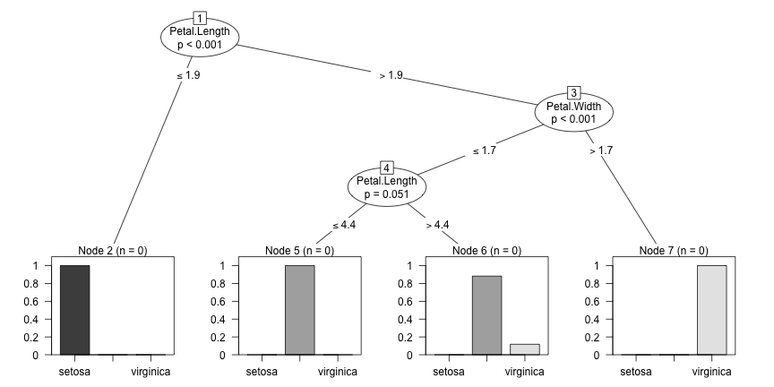

## The Assignment

1. Design a Simple Data Product using Shiny / R
2. Set Up a Presentation of the project

--- .class #id 

## Presentation of the Project

- Based on the IRIS data set
- Uses the `party` Package and its variant of Random Forests
- The User is allowed to set the number of trees in the forest
- The User can select any tree in the Forest and the tree is displayed graphically
- The User can enter Measures of an Iris and the predicted species is printed out.

### References

David Meyer, Achim Zeileis, and Kurt Hornik (2006). The Strucplot Framework: Visualizing Multi-Way Contingency Tables with vcd. Journal of Statistical Software, 17(3).

--- .class #id

## The `party` Package and `cforest` Function


```r
library(datasets)
library(party)
```

```
## Warning: package 'party' was built under R version 3.1.1
```

```
## Loading required package: grid
## Loading required package: zoo
## 
## Attaching package: 'zoo'
## 
## Les objets suivants sont masqués from 'package:base':
## 
##     as.Date, as.Date.numeric
## 
## Loading required package: sandwich
```

```
## Warning: package 'sandwich' was built under R version 3.1.1
```

```
## Loading required package: strucchange
## Loading required package: modeltools
## Loading required package: stats4
```

```r
  cf <- cforest(Species ~ ., data = iris, control=cforest_unbiased(ntree=12, mtry=4)) 
  pt <- party:::prettytree(cf@ensemble[[1]], names(cf@data@get("input"))) 
  nt <- new("BinaryTree") 
  nt@tree <- pt 
  nt@data <- cf@data 
  nt@responses <- cf@responses 
```

--- .class #id

## Example of a Tree for ntree=12, mtry=4

 

